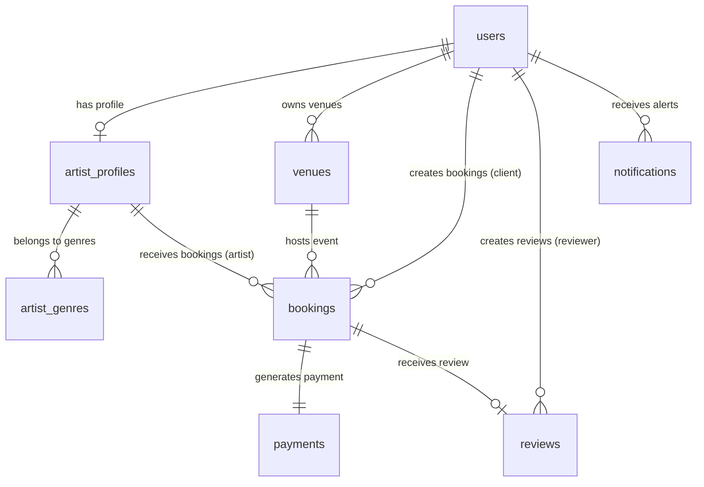

# Database Architecture & Entity Relationship Design (ERD)

This document details the complete production database design for **BandConnect** — the Music Band Booking Platform. It maps the schema properties, relationships, constraints, indexing strategies, migrations, and future database scalability paths.

---

## 1. Core Strategies & Conventions

### 1.1 Table Naming Conventions
- **Tables**: Plural and written in `snake_case` (e.g. `users`, `artist_profiles`, `bookings`).
- **Primary Keys**: Always named `id`, typed as `UUID` (UUIDv4), generated by the database/application.
- **Foreign Keys**: Named as `{singular_referenced_table}_id` (e.g. `user_id` inside `artist_profiles` referencing `users.id`).
- **Booleans**: Prefixed with `is_` (e.g. `is_active`, `is_verified`, `is_read`).
- **Timestamps**: Suffixed with `_at` (e.g. `created_at`, `updated_at`, `deleted_at`).
- **Enums**: Fields representing statuses or categories are stored as `VARCHAR` strings with check constraints.

### 1.2 UUID Generation Strategy
- All primary keys are **UUID v4**. 
- Database side: Default to `gen_random_uuid()` (PostgreSQL 13+ native) or custom generator extensions (like `uuid-ossp` extension's `uuid_generate_v4()`).
- Prevents sequential ID scanning attacks (Insecure Direct Object References - IDOR) and enables seamless multi-server database merges/sharding without ID collision.

### 1.3 Soft Delete Strategy
- Deletions are logical, not physical.
- Every table has a `deleted_at` timestamp field (`TIMESTAMP WITH TIME ZONE`), default `NULL`.
- A record is considered deleted if `deleted_at` is `NOT NULL`.
- All queries, joins, and indexing lookups must filter with `WHERE deleted_at IS NULL` to exclude logically deleted records.

### 1.4 Audit Columns
Every table contains the following mandatory audit columns:
- `created_at`: `TIMESTAMP WITH TIME ZONE`, defaults to `CURRENT_TIMESTAMP`, immutable.
- `updated_at`: `TIMESTAMP WITH TIME ZONE`, defaults to `CURRENT_TIMESTAMP`, updated automatically on row mutations.
- `deleted_at`: `TIMESTAMP WITH TIME ZONE`, nullable, defaults to `NULL`.

---

## 2. Table Schema Definitions

### 2.1 `users`
Represents the base credentials and authentication entity for all roles.
- `id`: `UUID` (PK)
- `email`: `VARCHAR(255)` (Unique, Indexed)
- `password_hash`: `VARCHAR(255)`
- `role`: `VARCHAR(50)` (Check constraint: `client`, `artist`, `venue_owner`, `admin`)
- `is_active`: `BOOLEAN` (Default: `TRUE`)
- `is_verified`: `BOOLEAN` (Default: `FALSE`)
- `created_at`: `TIMESTAMPTZ` (Default: `NOW()`)
- `updated_at`: `TIMESTAMPTZ` (Default: `NOW()`)
- `deleted_at`: `TIMESTAMPTZ` (Default: `NULL`)

### 2.2 `artist_profiles`
Detailed profile page information for performers.
- `id`: `UUID` (PK)
- `user_id`: `UUID` (FK -> `users.id`, Unique, Cascade delete)
- `name`: `VARCHAR(150)`
- `slug`: `VARCHAR(150)` (Unique, Indexed)
- `bio`: `TEXT`
- `hourly_rate`: `NUMERIC(12, 2)` (Check constraint: `hourly_rate >= 0`)
- `experience_years`: `INTEGER` (Check constraint: `experience_years >= 0`)
- `status`: `VARCHAR(50)` (Check: `pending_approval`, `active`, `suspended`)
- `created_at`: `TIMESTAMPTZ`
- `updated_at`: `TIMESTAMPTZ`
- `deleted_at`: `TIMESTAMPTZ`

### 2.3 `artist_genres` (Junction Table)
Links artists to music genres (many-to-many).
- `artist_profile_id`: `UUID` (FK -> `artist_profiles.id`, Composite PK)
- `genre`: `VARCHAR(50)` (Composite PK)

### 2.4 `venues`
Event spaces listed by venue owners.
- `id`: `UUID` (PK)
- `owner_id`: `UUID` (FK -> `users.id`, Indexed)
- `name`: `VARCHAR(150)`
- `slug`: `VARCHAR(150)` (Unique, Indexed)
- `address`: `VARCHAR(255)`
- `capacity`: `INTEGER` (Check: `capacity > 0`)
- `pricing`: `JSONB` (Dynamic pricing configurations)
- `amenities`: `JSONB` (List of strings/objects)
- `status`: `VARCHAR(50)` (Check: `active`, `suspended`)
- `created_at`: `TIMESTAMPTZ`
- `updated_at`: `TIMESTAMPTZ`
- `deleted_at`: `TIMESTAMPTZ`

### 2.5 `bookings`
Marketplace transaction records linking client, artist, and optional venue.
- `id`: `UUID` (PK)
- `client_id`: `UUID` (FK -> `users.id`, Indexed)
- `artist_id`: `UUID` (FK -> `artist_profiles.id`, Indexed)
- `venue_id`: `UUID` (FK -> `venues.id`, Nullable, Indexed)
- `event_date`: `DATE` (Indexed)
- `event_type`: `VARCHAR(100)`
- `duration_hours`: `NUMERIC(4, 2)` (Check: `duration_hours > 0`)
- `total_amount`: `NUMERIC(12, 2)` (Check: `total_amount >= 0`)
- `status`: `VARCHAR(50)` (Check: `pending`, `confirmed`, `completed`, `cancelled`, `rejected`)
- `created_at`: `TIMESTAMPTZ`
- `updated_at`: `TIMESTAMPTZ`
- `deleted_at`: `TIMESTAMPTZ`

### 2.6 `payments`
Escrow transactional payment records.
- `id`: `UUID` (PK)
- `booking_id`: `UUID` (FK -> `bookings.id`, Unique)
- `razorpay_order_id`: `VARCHAR(100)` (Unique)
- `razorpay_payment_id`: `VARCHAR(100)` (Nullable, Unique)
- `amount`: `NUMERIC(12, 2)`
- `currency`: `VARCHAR(3)` (Default: `INR`)
- `status`: `VARCHAR(50)` (Check: `pending`, `authorized`, `captured`, `refunded`, `failed`)
- `created_at`: `TIMESTAMPTZ`
- `updated_at`: `TIMESTAMPTZ`

### 2.7 `reviews`
Client feedback ratings submitted post-booking.
- `id`: `UUID` (PK)
- `booking_id`: `UUID` (FK -> `bookings.id`, Unique)
- `reviewer_id`: `UUID` (FK -> `users.id`, Indexed)
- `reviewee_id`: `UUID` (FK -> `users.id`, Indexed)
- `rating`: `INTEGER` (Check: `rating >= 1 AND rating <= 5`)
- `comment`: `TEXT`
- `created_at`: `TIMESTAMPTZ`
- `updated_at`: `TIMESTAMPTZ`
- `deleted_at`: `TIMESTAMPTZ`

### 2.8 `notifications`
Notification alerts dispatched to users.
- `id`: `UUID` (PK)
- `user_id`: `UUID` (FK -> `users.id`, Indexed)
- `title`: `VARCHAR(200)`
- `message`: `TEXT`
- `is_read`: `BOOLEAN` (Default: `FALSE`, Indexed)
- `type`: `VARCHAR(50)` (Check: `booking_update`, `payment_alert`, `support_update`)
- `created_at`: `TIMESTAMPTZ`

---

## 3. Entity Relationship Diagram (ERD)



---

## 4. Key Constraints & Database Validations

- **Unique Emails**: `users(email)` is unique to enforce single credential accounts.
- **Slugs**: `artist_profiles(slug)` and `venues(slug)` are unique to support URL routing structures.
- **Rating Limit Check**: `reviews` contain a check constraint: `rating >= 1 AND rating <= 5`.
- **Positive Rates**: `artist_profiles(hourly_rate)` and `bookings(total_amount)` checks verify values are non-negative.
- **One Escrow Payment Per Booking**: `payments(booking_id)` has a `UNIQUE` constraint.
- **Review Constraint**: A review can only be generated once per event booking: `reviews(booking_id)` is `UNIQUE`.

---

## 5. Performance Indexing Strategy

### 5.1 Indexes on Foreign Keys (Query Joins Performance)
Every joining foreign key is explicitly indexed to avoid full table scans:
- `CREATE INDEX idx_artist_profiles_user_id ON artist_profiles(user_id);`
- `CREATE INDEX idx_venues_owner_id ON venues(owner_id);`
- `CREATE INDEX idx_bookings_client_id ON bookings(client_id);`
- `CREATE INDEX idx_bookings_artist_id ON bookings(artist_id);`
- `CREATE INDEX idx_bookings_venue_id ON bookings(venue_id);`

### 5.2 Partial Indexes for Soft Delete
Since queries filter out soft-deleted records, partial indexes are implemented to ignore deleted records:
- `CREATE INDEX idx_active_bookings ON bookings(event_date) WHERE deleted_at IS NULL;`
- `CREATE INDEX idx_active_artists ON artist_profiles(status) WHERE deleted_at IS NULL;`

### 5.3 Filter and Sort Indexes
- **Dynamic Search Filtering**:
  - `CREATE INDEX idx_notifications_unread ON notifications(user_id) WHERE is_read = FALSE;`
- **Text Search Trigram Indexes**:
  - PostgreSQL Gin (Generalized Inverted Index) for name and bio matching:
    `CREATE INDEX idx_artists_search_gin ON artist_profiles USING gin (to_tsvector('english', name || ' ' || bio));`

---

## 6. Migration & Deployment Strategy

- **Tooling**: Python-native **Alembic** acts as the schema tracking and deployment manager.
- **Immutability rule**: Migration version scripts are immutable once committed. Reversing a schema change requires creating a new migration version containing `upgrade()` and `downgrade()` code blocks.
- **Rolling Deployment Safe Changes**:
  - Column addition: Nullable first or with a default value.
  - Column deletion: Mark deprecated first, migrate query dependencies, drop in next release block.

---

## 7. Future Database Scaling Strategy

```
                          PostgreSQL Scaling (10k - 100k Transactions)
                                               |
              +--------------------------------+--------------------------------+
              |                                |                                |
    [Read/Write Split]               [Database Partitioning]           [JSONB Optimization]
Primary R/W Instance             Partition bookings table           amenities & metadata index
      |                          by year/month boundaries           via GIN index operators
      +-> Read Replica 1
      +-> Read Replica 2
```

1. **Read/Write Replica Splitting**: Move heavy list queries (e.g. browsing artists) to Read Replicas, leaving only bookings mutations on the Primary PostgreSQL instance.
2. **Database Partitioning**: Partition the large transactional `bookings` table by range boundaries (e.g., partitioning dynamically by `event_date` per year).
3. **JSONB Indexing**: Utilize GIN indexing operators on the `venues.amenities` and `venues.pricing` JSONB structures to allow performant nested queries without normalized tables overhead.
4. **Data Strangling & Extraction**: Extract the transactional payments database space to a dedicated PostgreSQL database during microservices migration (Strangler Fig Pattern).
